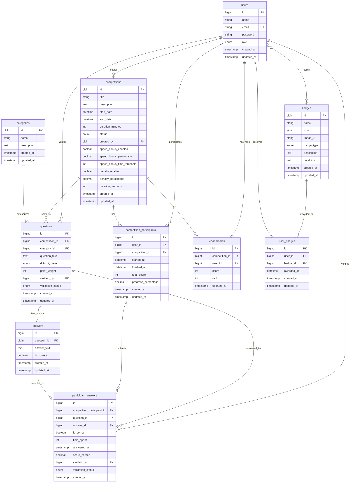

# Database Migrations - Platform Kompetisi Quiz Online

## Daftar Migration Files

Total: **16 migration files**

### 1. Laravel Default Migrations

| No | File | Tanggal | Deskripsi |
|----|------|---------|-----------|
| 1 | `0001_01_01_000000_create_users_table.php` | Default | Tabel users, password_reset_tokens, sessions |
| 2 | `0001_01_01_000001_create_cache_table.php` | Default | Tabel cache Laravel |
| 3 | `0001_01_01_000002_create_jobs_table.php` | Default | Tabel jobs untuk queue |

### 2. Core Application Migrations

| No | File | Tanggal | Deskripsi |
|----|------|---------|-----------|
| 4 | `2025_11_17_214931_create_competitions_table.php` | 2025-11-17 | Tabel kompetisi |
| 5 | `2025_11_17_214932_create_categories_table.php` | 2025-11-17 | Tabel kategori soal |
| 6 | `2025_11_17_214932_create_questions_table.php` | 2025-11-17 | Tabel soal quiz |
| 7 | `2025_11_17_214933_create_answers_table.php` | 2025-11-17 | Tabel pilihan jawaban |
| 8 | `2025_11_17_214933_create_competition_participants_table.php` | 2025-11-17 | Tabel peserta kompetisi |
| 9 | `2025_11_17_214934_create_badges_table.php` | 2025-11-17 | Tabel badge/penghargaan |
| 10 | `2025_11_17_214934_create_leaderboards_table.php` | 2025-11-17 | Tabel leaderboard |
| 11 | `2025_11_17_214934_create_participant_answers_table.php` | 2025-11-17 | Tabel jawaban peserta |
| 12 | `2025_11_17_214938_create_user_badges_table.php` | 2025-11-17 | Tabel pivot user-badge |

### 3. Enhancement Migrations

| No | File | Tanggal | Deskripsi |
|----|------|---------|-----------|
| 13 | `2025_11_22_133239_add_scoring_fields_to_competitions.php` | 2025-11-22 | Tambah field scoring (speed bonus, penalty) |
| 14 | `2025_11_22_133244_add_answered_at_and_score_to_participant_answers.php` | 2025-11-22 | Tambah field answered_at & score_earned |
| 15 | `2025_11_23_162706_add_slug_to_competitions_table.php` | 2025-11-23 | ⚠️ Empty migration (belum diimplementasi) |
| 16 | `2025_11_25_073627_add_icon_and_type_to_badges_table.php` | 2025-11-25 | Tambah icon & badge_type |

---

## Detail Struktur Tabel

### 1. users
**Deskripsi:** Tabel pengguna sistem dengan 3 role

| Field | Type | Constraint | Keterangan |
|-------|------|------------|------------|
| id | bigint | PK, AI | Primary key |
| name | varchar(255) | NOT NULL | Nama lengkap |
| email | varchar(255) | UNIQUE, NOT NULL | Email login |
| password | varchar(255) | NOT NULL | Password (hashed) |
| role | enum | DEFAULT 'peserta' | admin, peserta, qualifier |
| created_at | timestamp | NULL | Waktu dibuat |
| updated_at | timestamp | NULL | Waktu diupdate |

**Related Tables:**
- `password_reset_tokens` - Reset password
- `sessions` - Session management

---

### 2. competitions
**Deskripsi:** Tabel kompetisi quiz

| Field | Type | Constraint | Keterangan |
|-------|------|------------|------------|
| id | bigint | PK, AI | Primary key |
| title | varchar(255) | NOT NULL | Judul kompetisi |
| description | text | NOT NULL | Deskripsi kompetisi |
| start_date | datetime | NOT NULL | Tanggal mulai |
| end_date | datetime | NOT NULL | Tanggal selesai |
| duration_minutes | int | DEFAULT 60 | Durasi dalam menit |
| status | enum | DEFAULT 'draft' | draft, active, inactive |
| created_by | bigint | FK → users | Admin pembuat |
| **speed_bonus_enabled** | boolean | DEFAULT true | Aktifkan speed bonus |
| **speed_bonus_percentage** | decimal(5,2) | DEFAULT 20.00 | Persentase bonus |
| **speed_bonus_time_threshold** | int | DEFAULT 30 | Threshold waktu (detik) |
| **penalty_enabled** | boolean | DEFAULT false | Aktifkan penalty |
| **penalty_percentage** | decimal(5,2) | DEFAULT 10.00 | Persentase penalty |
| **duration_seconds** | int | DEFAULT 300 | Durasi quiz (detik) |
| created_at | timestamp | NULL | Waktu dibuat |
| updated_at | timestamp | NULL | Waktu diupdate |

**Relationships:**
- `created_by` → `users.id` (ON DELETE CASCADE)

---

### 3. categories
**Deskripsi:** Tabel kategori soal

| Field | Type | Constraint | Keterangan |
|-------|------|------------|------------|
| id | bigint | PK, AI | Primary key |
| name | varchar(255) | NOT NULL | Nama kategori |
| description | text | NULL | Deskripsi kategori |
| created_at | timestamp | NULL | Waktu dibuat |
| updated_at | timestamp | NULL | Waktu diupdate |

---

### 4. questions
**Deskripsi:** Tabel soal quiz

| Field | Type | Constraint | Keterangan |
|-------|------|------------|------------|
| id | bigint | PK, AI | Primary key |
| competition_id | bigint | FK → competitions | ID kompetisi |
| category_id | bigint | FK → categories | ID kategori |
| question_text | text | NOT NULL | Teks soal |
| difficulty_level | enum | DEFAULT 'medium' | easy, medium, hard |
| point_weight | int | DEFAULT 10 | Bobot poin |
| verified_by | bigint | FK → users, NULL | Qualifier yang verifikasi |
| validation_status | enum | DEFAULT 'pending' | pending, approved, rejected |
| created_at | timestamp | NULL | Waktu dibuat |
| updated_at | timestamp | NULL | Waktu diupdate |

**Relationships:**
- `competition_id` → `competitions.id` (ON DELETE CASCADE)
- `category_id` → `categories.id` (ON DELETE CASCADE)
- `verified_by` → `users.id` (ON DELETE SET NULL)

---

### 5. answers
**Deskripsi:** Tabel pilihan jawaban untuk soal

| Field | Type | Constraint | Keterangan |
|-------|------|------------|------------|
| id | bigint | PK, AI | Primary key |
| question_id | bigint | FK → questions | ID soal |
| answer_text | text | NOT NULL | Teks jawaban |
| is_correct | boolean | DEFAULT false | Jawaban benar/salah |
| created_at | timestamp | NULL | Waktu dibuat |
| updated_at | timestamp | NULL | Waktu diupdate |

**Relationships:**
- `question_id` → `questions.id` (ON DELETE CASCADE)

---

### 6. competition_participants
**Deskripsi:** Tabel peserta yang ikut kompetisi

| Field | Type | Constraint | Keterangan |
|-------|------|------------|------------|
| id | bigint | PK, AI | Primary key |
| user_id | bigint | FK → users | ID peserta |
| competition_id | bigint | FK → competitions | ID kompetisi |
| started_at | datetime | NULL | Waktu mulai quiz |
| finished_at | datetime | NULL | Waktu selesai quiz |
| total_score | int | DEFAULT 0 | Total skor |
| progress_percentage | decimal(5,2) | DEFAULT 0 | Persentase progress |
| created_at | timestamp | NULL | Waktu dibuat |
| updated_at | timestamp | NULL | Waktu diupdate |

**Constraints:**
- UNIQUE (`user_id`, `competition_id`) - Satu user hanya bisa ikut 1x per kompetisi

**Relationships:**
- `user_id` → `users.id` (ON DELETE CASCADE)
- `competition_id` → `competitions.id` (ON DELETE CASCADE)

---

### 7. participant_answers
**Deskripsi:** Tabel jawaban peserta untuk setiap soal

| Field | Type | Constraint | Keterangan |
|-------|------|------------|------------|
| id | bigint | PK, AI | Primary key |
| competition_participant_id | bigint | FK → competition_participants | ID peserta kompetisi |
| question_id | bigint | FK → questions | ID soal |
| answer_id | bigint | FK → answers | ID jawaban dipilih |
| is_correct | boolean | DEFAULT false | Benar/salah |
| time_spent | int | DEFAULT 0 | Waktu jawab (detik) |
| **answered_at** | timestamp | NULL | Waktu dijawab |
| **score_earned** | decimal(8,2) | DEFAULT 0 | Skor yang didapat |
| verified_by | bigint | FK → users, NULL | Qualifier verifikasi |
| validation_status | enum | DEFAULT 'pending' | pending, approved, rejected |
| created_at | timestamp | NULL | Waktu dibuat |

**Constraints:**
- UNIQUE (`competition_participant_id`, `question_id`) - Satu soal hanya dijawab 1x

**Relationships:**
- `competition_participant_id` → `competition_participants.id` (ON DELETE CASCADE)
- `question_id` → `questions.id` (ON DELETE CASCADE)
- `answer_id` → `answers.id` (ON DELETE CASCADE)
- `verified_by` → `users.id` (ON DELETE SET NULL)

---

### 8. leaderboards
**Deskripsi:** Tabel ranking peserta per kompetisi

| Field | Type | Constraint | Keterangan |
|-------|------|------------|------------|
| id | bigint | PK, AI | Primary key |
| competition_id | bigint | FK → competitions | ID kompetisi |
| user_id | bigint | FK → users | ID peserta |
| score | int | DEFAULT 0 | Total skor |
| rank | int | DEFAULT 0 | Peringkat |
| updated_at | timestamp | NULL | Waktu diupdate |

**Constraints:**
- UNIQUE (`competition_id`, `user_id`)
- INDEX (`competition_id`, `rank`)

**Relationships:**
- `competition_id` → `competitions.id` (ON DELETE CASCADE)
- `user_id` → `users.id` (ON DELETE CASCADE)

---

### 9. badges
**Deskripsi:** Tabel badge/penghargaan

| Field | Type | Constraint | Keterangan |
|-------|------|------------|------------|
| id | bigint | PK, AI | Primary key |
| name | varchar(255) | NOT NULL | Nama badge |
| **icon** | varchar(255) | NULL | Icon class/emoji |
| **image_url** | varchar(255) | NULL | URL gambar custom |
| **badge_type** | enum | DEFAULT 'achievement' | achievement, streak, milestone, special |
| description | text | NULL | Deskripsi badge |
| condition | text | NULL | Kondisi mendapat badge |
| created_at | timestamp | NULL | Waktu dibuat |
| updated_at | timestamp | NULL | Waktu diupdate |

---

### 10. user_badges
**Deskripsi:** Tabel pivot user dan badge (many-to-many)

| Field | Type | Constraint | Keterangan |
|-------|------|------------|------------|
| id | bigint | PK, AI | Primary key |
| user_id | bigint | FK → users | ID user |
| badge_id | bigint | FK → badges | ID badge |
| awarded_at | datetime | NOT NULL | Waktu diberikan |
| created_at | timestamp | NULL | Waktu dibuat |
| updated_at | timestamp | NULL | Waktu diupdate |

**Constraints:**
- UNIQUE (`user_id`, `badge_id`) - Satu badge hanya diberikan 1x per user

**Relationships:**
- `user_id` → `users.id` (ON DELETE CASCADE)
- `badge_id` → `badges.id` (ON DELETE CASCADE)

---

## Entity Relationship Diagram (ERD)



---

## Migration Issues & Recommendations

### ⚠️ Issues Found:

1. **Empty Migration**
   - File: `2025_11_23_162706_add_slug_to_competitions_table.php`
   - Status: Migration kosong, tidak ada implementasi
   - **Rekomendasi:** Hapus atau implementasikan field `slug` untuk SEO-friendly URL

2. **Redundant Duration Fields**
   - `competitions.duration_minutes` (original)
   - `competitions.duration_seconds` (added later)
   - **Rekomendasi:** Gunakan satu field saja, atau hapus `duration_minutes`

### ✅ Good Practices:

1. ✅ Foreign key constraints dengan ON DELETE CASCADE/SET NULL
2. ✅ Unique constraints untuk mencegah duplikasi
3. ✅ Index pada kolom yang sering di-query (leaderboard)
4. ✅ Default values yang masuk akal
5. ✅ Enum untuk field dengan nilai terbatas
6. ✅ Timestamp untuk audit trail

---

## Migration Commands

```bash
# Run all migrations
php artisan migrate

# Rollback last batch
php artisan migrate:rollback

# Rollback all migrations
php artisan migrate:reset

# Refresh database (drop all tables and re-migrate)
php artisan migrate:fresh

# Refresh with seeding
php artisan migrate:fresh --seed

# Check migration status
php artisan migrate:status
```

---

## Database Statistics

- **Total Tables:** 13 tables (excluding Laravel default cache/jobs)
- **Total Relationships:** 15 foreign keys
- **Unique Constraints:** 5
- **Indexes:** 2 (leaderboard optimization)
- **Enum Fields:** 6 (role, status, difficulty, validation_status, badge_type)

