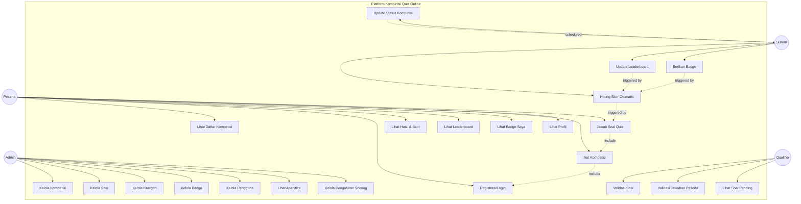
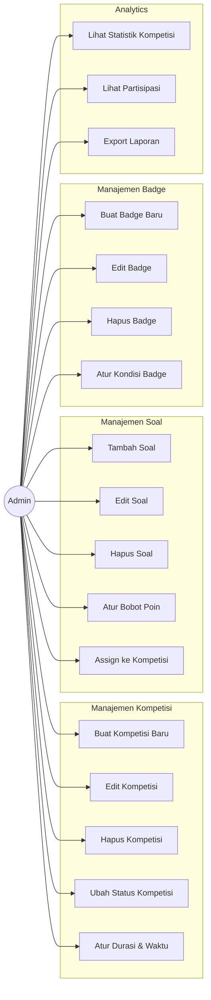
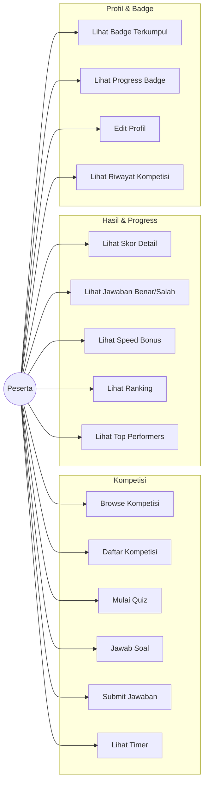
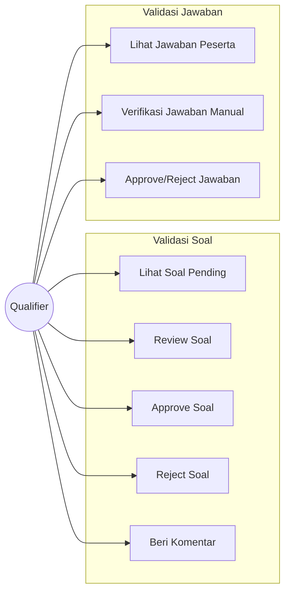
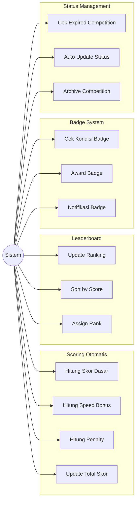
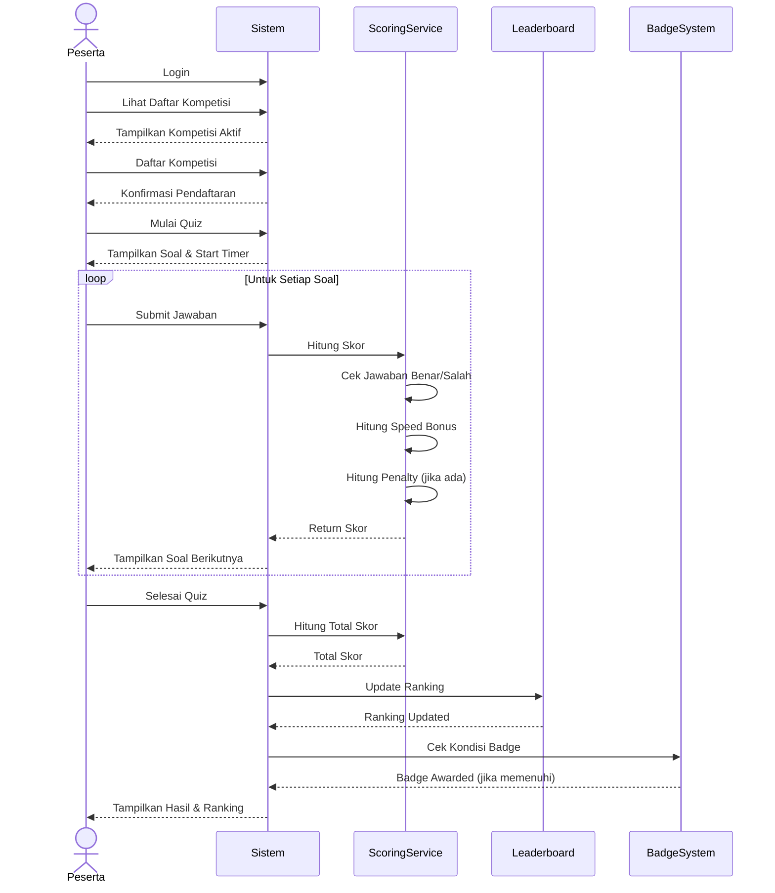

# Use Case Diagram - Platform Kompetisi Quiz Online

## Diagram Use Case Utama

## Detail Use Case per Aktor

### 1. Admin

### 2. Peserta

### 3. Qualifier

### 4. Sistem (Automated)

## Flow Diagram: Peserta Mengikuti Kompetisi

## Prioritas Use Case

### High Priority (MVP)
1. ✅ UC1: Kelola Kompetisi
2. ✅ UC2: Kelola Soal
3. ✅ UC8: Registrasi/Login
4. ✅ UC10: Ikut Kompetisi
5. ✅ UC11: Jawab Soal Quiz
6. ✅ UC19: Hitung Skor Otomatis
7. ✅ UC13: Lihat Leaderboard

### Medium Priority
1. UC16: Validasi Soal
2. UC14: Lihat Badge Saya
3. UC21: Berikan Badge
4. UC6: Lihat Analytics
5. UC22: Update Status Kompetisi

### Low Priority
1. UC17: Validasi Jawaban Peserta (Manual)
2. UC7: Kelola Pengaturan Scoring Advanced
3. Export/Import Features

